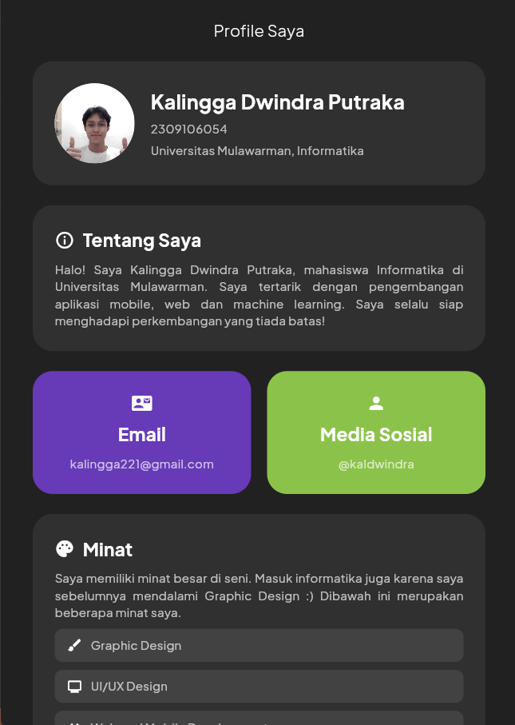
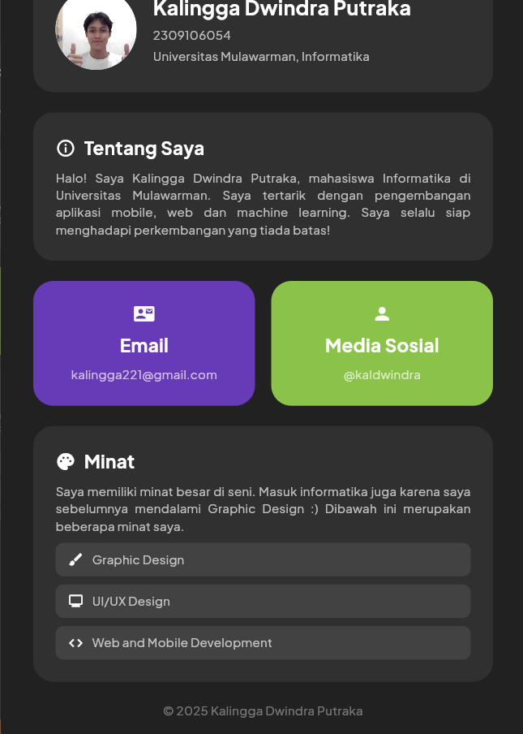

# Basic Flutter - Profile Page

Tugas 1 Mobile Programming yaitu membuat profile page sesuai preferensi Mahasiswa.

## Identitas Diri

- Kalingga Dwindra Putraka
- 2309106054

## Screenshots

  
  

## Kriteria Aplikasi

- Percobaan penggunaan reusable widgets pada bar "Profil Saya"
- Stateless Widgets
- Plus Jakarta Sans by Google Fonts
- Row and Column for better layout
